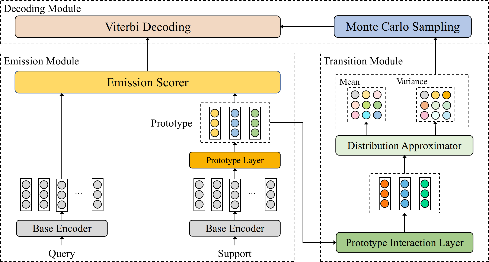

Few-Shot Event Detection with Prototypical Amortized Conditional Random Field
===

This code is for Findings of ACL 2021 paper "Few-Shot Event Detection with Prototypical Amortized Conditional Random Field".

Overview
---



In this work, we present PA-CRF to solve the few-shot event detection task. It models the label dependency in the few-shot scenario by approximating the transition scores between labels based on the label prototypes. Gaussian distribution is introduced to alleviate the uncertain estimation resulting from insufficient data. Experimental results show that our PA-CRF achieves the best results on the benchmark dataset FewEvent.

You can find the paper [here](https://arxiv.org/abs/2012.02353).

Requirements
---

```
python=3.7
pytorch=1.5.1
cuda=10.2
transformers=2.8.0
```

**NOTE**: Different versions of packages (such as `pytorch`, `transformers`, etc.) may lead to different results from the paper. However, the trend should still hold no matter what versions of packages you use.

Usage
---

1. Training model

```shell
python main.py --model=pa_crf --trainN=5 --evalN=5 --K=5 --Q=1
```

After training, this script will evaluate the model automatically. The best model will be saved in `checkpoint` directory. 

All hyper-parameters are listed in `config.py` file. You can change it to conduct more experiments.

2. Evaluation

```shell
python main.py --model=pa_crf --trainN=5 --evalN=5 --K=5 --Q=1 --load_ckpt="your_checkpoint_name_saved_in_checkpoint_dir" --test
```

Citation
---

```
@inproceedings{cong2021PACRF,
 author = {Cong, Xin and Cui, Shiyao and Yu, Bowen and Liu, Tingwen and Wang, Yubin and Wang, Bin},
 booktitle = {Proc. of Findings of ACL},
 title = {Few-Shot Event Detection with Prototypical Amortized Conditional Random Field},
 year = {2021}
}
```
